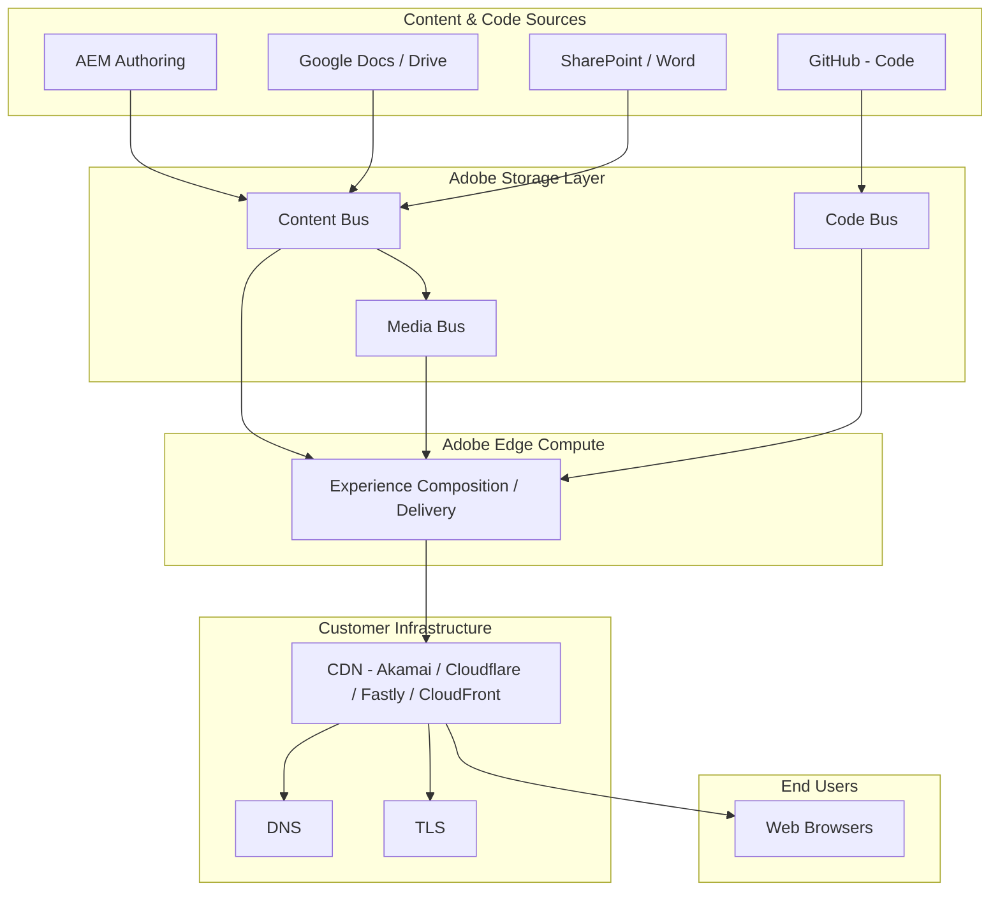
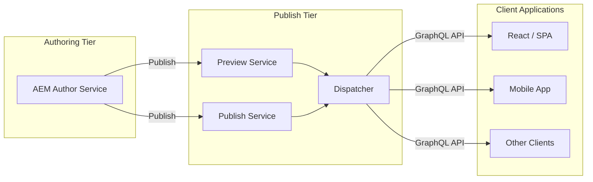
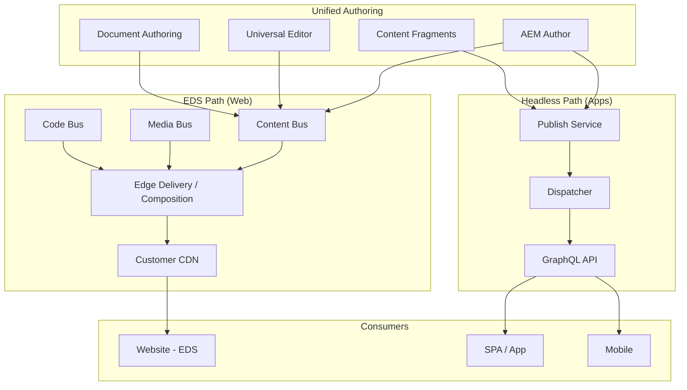
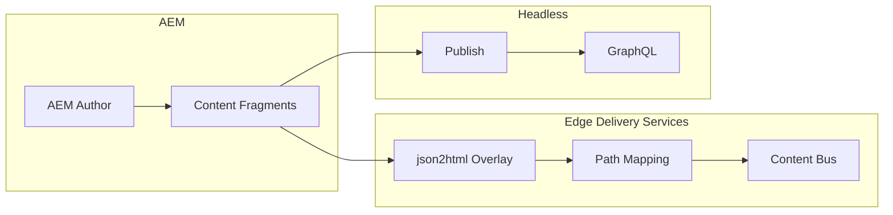

# AEM Edge Delivery Services vs AEM Headless: Evaluation & Architecture Guide

**Document Version:** 1.0  
**Date:** February 26, 2026  
**Audience:** Solution architects, technical leads, and decision-makers  
**Purpose:** Compare AEM Edge Delivery Services (EDS) and AEM Headless; provide pros/cons, hybrid use cases, and high-level architecture diagrams.

---

## Table of Contents

1. [Executive Summary](#1-executive-summary)
2. [Technology Comparison](#2-technology-comparison)
3. [EDS Only: Pros and Cons](#3-eds-only-pros-and-cons)
4. [Headless Only: Pros and Cons](#4-headless-only-pros-and-cons)
5. [Hybrid (EDS + Headless): Pros and Cons](#5-hybrid-eds--headless-pros-and-cons)
6. [Sample Use Cases for Hybrid Approach](#6-sample-use-cases-for-hybrid-approach)
7. [High-Level Architecture Diagrams](#7-high-level-architecture-diagrams)
8. [References](#8-references)

---

## 1. Executive Summary

| Aspect | AEM Edge Delivery Services (EDS) | AEM Headless |
|--------|----------------------------------|--------------|
| **Role** | The “head”—delivers fast HTML (and optionally JSON) at the edge | Content source—exposes structured content via GraphQL APIs |
| **Delivery model** | Edge-first, composable; replaces AEM Publish/Dispatcher | Author → Publish → Dispatcher; apps consume Publish via APIs |
| **Authoring** | Document-based (Word, Google Docs), Universal Editor, or AEM as content source | AEM Author → Content Fragments; GraphQL for consumption |
| **Best for** | Marketing sites, content-heavy pages, SEO/GEO, rapid iteration | SPAs, mobile apps, IoT, multi-channel apps needing structured content |

**Key insight:** EDS is not a headless CMS; it is a performance-first delivery layer that can use AEM (or other sources) as content origin. AEM Headless is the traditional API-first content delivery model. They can be used **together** in a hybrid model: EDS for the main website experience and Headless (Content Fragments + GraphQL) for app-specific or embedded content.

---

## 2. Technology Comparison

| Dimension | AEM Edge Delivery Services | AEM Headless |
|-----------|----------------------------|--------------|
| **Architecture** | Four-layer: Content/Code sources → Storage (Content/Media/Code Bus) → Edge compute → Customer CDN | Author → Publish (optional Preview) → Dispatcher → Client apps |
| **Content format** | Semantic HTML (and spreadsheets → JSON APIs) | Content Fragments exposed via GraphQL |
| **Caching** | CDN-purge on publish; edge-optimized storage | Dispatcher + CDN in front of Publish |
| **Authoring** | Word/Google Docs, SharePoint, Universal Editor, or AEM authoring | AEM Author + Content Fragment models |
| **Developer stack** | HTML, CSS, JS in GitHub; blocks; no build step for content | Any client (React, mobile, etc.) calling GraphQL |
| **Publish flow** | Preview → Publish via Sidekick; content pushed to storage; CDN purge | Author → Publish (and optionally Preview); Dispatcher cache |
| **Performance** | Optimized for LCP, 100 Lighthouse; edge rendering | Depends on client app and API usage |
| **Multi-channel** | Web-first; can expose JSON for other channels | Native fit for apps, kiosks, syndication |

References: [AEM Architecture](https://www.aem.live/docs/architecture), [Architecture of AEM Headless](https://experienceleague.adobe.com/en/docs/experience-manager-cloud-service/content/headless/deployment/architecture).

---

## 3. EDS Only: Pros and Cons

### Pros

- **Performance:** Edge delivery, minimal backend round-trips, strong LCP and Core Web Vitals; supports 100 Lighthouse score goals.
- **SEO & GEO:** Full semantic HTML by default; ideal for search and LLM crawlers.
- **Velocity:** Document-based or Universal Editor authoring; publish without builds; fast iteration.
- **Simplicity:** No transpilation/bundlers; standard HTML/CSS/JS; good fit for AI-assisted development.
- **Flexible content sources:** Google Drive, SharePoint, or AEM authoring; not locked to one CMS.
- **Cost-effective delivery:** Composable edge + your CDN (or Adobe-managed CDN); no traditional Publish/Dispatcher to operate for EDS traffic.
- **Branch-based preview:** Every Git branch gets a preview URL for safe testing.

### Cons

- **Web-centric:** Best for websites; less natural for pure app-to-API integrations without an EDS “head.”
- **Limited structured API:** Out-of-the-box is HTML + spreadsheet-derived JSON; no built-in GraphQL for arbitrary Content Fragments.
- **Learning curve:** Different mental model than classic AEM (blocks, Sidekick, document-based flows).
- **Custom logic:** Complex business rules or app-like interactivity may require more custom JS or integration points.

---

## 4. Headless Only: Pros and Cons

### Pros

- **Structured content:** Content Fragments and GraphQL give strong content modeling and reuse across channels.
- **Multi-channel by design:** Same content for web, mobile, IoT, kiosks, syndication.
- **Familiar AEM model:** Author → Publish → Dispatcher; workflows, permissions, preview.
- **Rich content model:** Nested fragments, references, variations; good for complex product or editorial models.
- **Preview service:** Staging/preview with same auth as production for QA.
- **API-first:** Fits SPAs and native apps that need JSON, not HTML.

### Cons

- **Performance depends on client:** Each app must implement caching, loading, and UX; no built-in “fast HTML” delivery.
- **SEO effort:** SPAs require SSR or prerendering for strong SEO; more work than EDS’s default HTML.
- **Operational footprint:** Publish (and Preview), Dispatcher, and CDN to run and tune.
- **Slower content-to-glass:** Build/deploy or client fetch can add latency compared to edge HTML.
- **Not a “website in a box”:** You build and maintain the application that consumes the API.

---

## 5. Hybrid (EDS + Headless): Pros and Cons

### Pros

- **Best of both:** EDS for fast, SEO-friendly web pages; Headless for structured content in apps or embedded experiences.
- **Content reuse:** One AEM (or EDS + AEM) source: document-based/Universal Editor for EDS, Content Fragments for GraphQL consumers.
- **Proven hybrid pattern:** Content Fragments can be published to EDS as semantic HTML (e.g. [Content Fragment overlay](https://www.aem.live/developer/content-fragment-overlay)); EDS acts as the “head” for headless content where needed.
- **Progressive adoption:** Move high-traffic or SEO-critical pages to EDS; keep app or legacy flows on Headless.
- **Unified authoring:** Authors can use AEM (Universal Editor or Content Fragments) and still feed both EDS and headless clients.

### Cons

- **Complexity:** Two delivery paths (EDS + GraphQL), two mental models, and more moving parts.
- **Governance:** Clear rules needed for when to use EDS vs Headless (e.g. by section, by content type).
- **Configuration:** Path mapping, overlay, and (if used) json2html/Mustache for Content Fragments to EDS.
- **Skills:** Teams need to understand both EDS (blocks, Sidekick, storage) and Headless (GraphQL, Content Fragments).

---

## 6. Sample Use Cases for Hybrid Approach

1. **Marketing site + member/app portal**  
   - **EDS:** Marketing homepage, landing pages, blog, SEO-critical content (semantic HTML, fast).  
   - **Headless:** Logged-in member portal or app (React/SPA) consuming Content Fragments via GraphQL for personalized, structured content.

2. **Editorial site + syndication and apps**  
   - **EDS:** Main editorial website (articles, categories) for readers and search engines.  
   - **Headless:** Same articles as Content Fragments via GraphQL for mobile app, partners, or third-party syndication.

3. **Product marketing + configurators**  
   - **EDS:** Product marketing pages, campaigns, and support content (fast, editable by marketing).  
   - **Headless:** Product data and configuration options as Content Fragments/GraphQL for configurator UIs or integrations.

4. **Corporate site + intranet / internal tools**  
   - **EDS:** Public corporate site (about, news, careers).  
   - **Headless:** Internal tools or intranet consuming structured policies, FAQs, or knowledge base via GraphQL.

5. **Landing pages + embedded widgets**  
   - **EDS:** High-performance landing pages and forms.  
   - **Headless:** Reusable content (e.g. FAQs, disclaimers) as Content Fragments consumed by EDS blocks or by embedded widgets on third-party sites.

6. **Geo/LLM and app consumption**  
   - **EDS:** Full content as semantic HTML for SEO and LLM crawlers.  
   - **Headless:** Same or related content as structured JSON for apps, chatbots, or voice assistants.

References: [AEM Sites and Edge Delivery Services](https://experienceleague.adobe.com/en/docs/experience-manager-cloud-service/content/sites/sites-and-edge), [Publishing AEM Content Fragments to Edge Delivery Services](https://www.aem.live/developer/content-fragment-overlay).

---

## 7. High-Level Architecture Diagrams

All diagrams are in Mermaid format for use in Markdown viewers and CI/docs pipelines.

---

### 7.1 EDS Only (Edge Delivery Services)

Content and code flow from various sources into Adobe’s storage and edge compute; the customer CDN serves the final experience. No AEM Publish in the path.

**Summary:** Authors use AEM, Docs, or SharePoint; code lives in GitHub. Content and code are stored in Adobe’s buses; edge compose serves HTML; customer CDN delivers to users. No Publish/Dispatcher.

---

### 7.2 Headless Only (AEM Headless)

Classic Author → Publish (and optional Preview) with Dispatcher; client applications consume content via GraphQL.

**Summary:** Content is created in AEM Author and published to Publish (and optionally Preview). Dispatcher caches and secures; clients request Content Fragments via GraphQL. No EDS in this path.

---

### 7.3 Hybrid: EDS and Headless Working Together

EDS powers the main website (and can consume AEM or Content Fragments); the same or related content is also exposed via GraphQL for apps. AEM Author feeds both paths.

**Optional overlay (Content Fragments → EDS):** Content Fragments can be published to EDS as HTML via path mapping and json2html/Mustache overlay so that EDS pages can include fragment-driven content while Headless clients still use GraphQL.

**Summary:** One authoring base (AEM + optional document sources) feeds EDS for the web and Publish/GraphQL for apps. Content Fragments can be surfaced both as HTML on EDS and as JSON via Headless.

---

## 8. References

| Resource | URL |
|----------|-----|
| AEM Documentation (Build, Publish, Launch) | [https://www.aem.live/docs/](https://www.aem.live/docs/) |
| EDS Architecture | [https://www.aem.live/docs/architecture](https://www.aem.live/docs/architecture) |
| EDS FAQ | [https://www.aem.live/docs/faq](https://www.aem.live/docs/faq) |
| Authoring and Publishing | [https://www.aem.live/docs/authoring](https://www.aem.live/docs/authoring) |
| AEM Headless Architecture | [Architecture of AEM Headless](https://experienceleague.adobe.com/en/docs/experience-manager-cloud-service/content/headless/deployment/architecture) |
| Edge Delivery Services Overview | [Edge Delivery Services Overview](https://experienceleague.adobe.com/en/docs/experience-manager-cloud-service/content/edge-delivery/overview) |
| AEM Sites and Edge Delivery Services | [AEM Sites and Edge Delivery Services](https://experienceleague.adobe.com/en/docs/experience-manager-cloud-service/content/sites/sites-and-edge) |
| Publishing Content Fragments to EDS | [Publishing AEM Content Fragments to Edge Delivery Services](https://www.aem.live/developer/content-fragment-overlay) |

---

*This document was produced using the [docs-search skill](.skills/docs-search/SKILL.md) and official AEM/EDS documentation. For project-specific migration and block development, use the content-driven-development and related skills in `.skills/`.*
