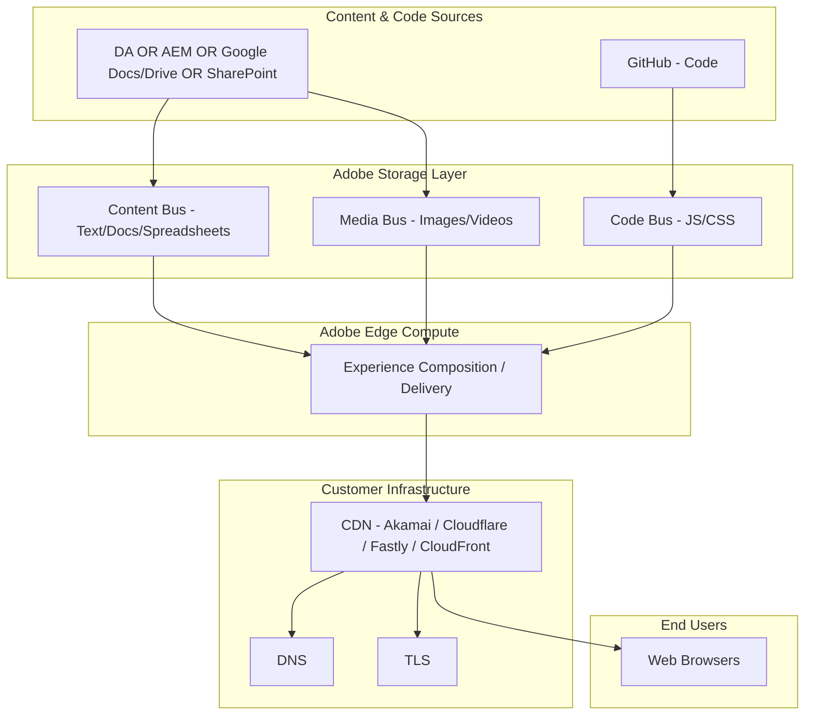
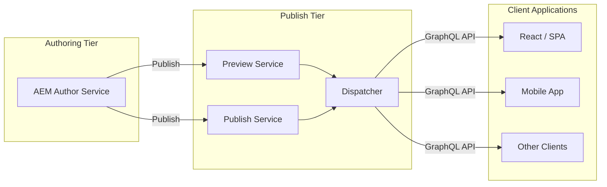
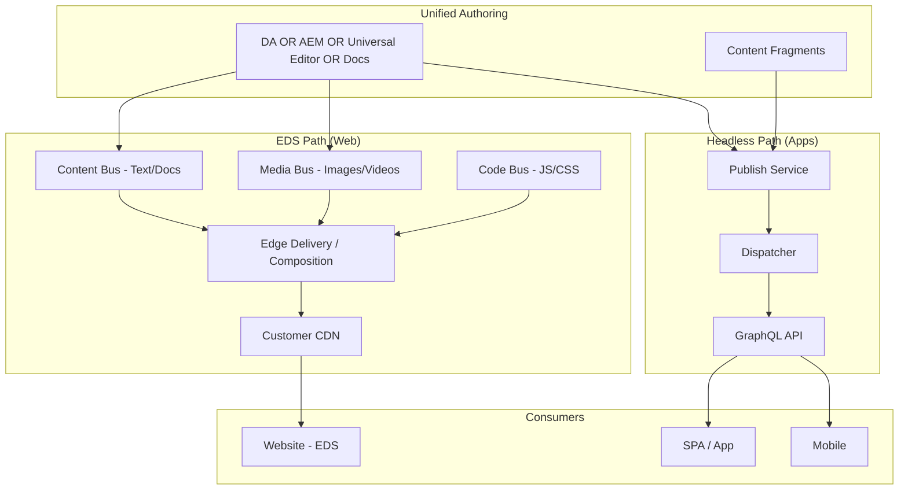
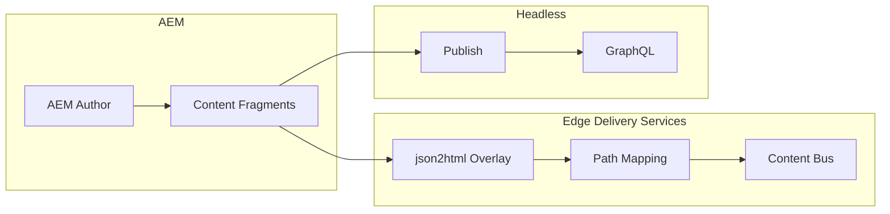

# AEM Edge Delivery Services vs AEM Headless: Evaluation & Architecture Guide

**Document Version:** 1.2
**Date:** March 2, 2026  
**Audience:** Solution architects, technical leads, and decision-makers  
**Purpose:** Compare AEM Edge Delivery Services (EDS) and AEM Headless; provide pros/cons, hybrid use cases, and high-level architecture diagrams.

---

## Table of Contents

1. [Executive Summary](#1-executive-summary)
2. [Glossary](#2-glossary)
3. [High-Level Architecture Diagrams](#3-high-level-architecture-diagrams)
4. [Technology Comparison](#4-technology-comparison)
5. [Operational Differences](#5-operational-differences)
6. [Personalization Differences](#6-personalization-differences)
7. [EDS Only: Pros and Cons](#7-eds-only-pros-and-cons)
8. [Headless Only: Pros and Cons](#8-headless-only-pros-and-cons)
9. [Hybrid (EDS + Headless): Pros and Cons](#9-hybrid-eds--headless-pros-and-cons)
10. [Sample Use Cases for Hybrid Approach](#10-sample-use-cases-for-hybrid-approach)
11. [References](#11-references)

---

## 1. Executive Summary

| Aspect | AEM Edge Delivery Services (EDS) | AEM Headless |
|--------|----------------------------------|--------------|
| **Role** | The “head”—delivers fast HTML (and optionally JSON) at the edge | Content source—exposes structured content via GraphQL APIs |
| **Delivery model** | Edge-first, composable; replaces AEM Publish/Dispatcher | Author → Publish → Dispatcher; apps consume Publish via APIs |
| **Authoring** | Document Authoring (DA), Word/Google Docs, SharePoint, Universal Editor, or AEM authoring (choose based on organizational needs) | AEM Author → Content Fragments; GraphQL for consumption |
| **Best for** | Marketing sites, content-heavy pages, SEO/GEO, rapid iteration | SPAs, mobile apps, IoT, multi-channel apps needing structured content |

**Key insight:** EDS is not a headless CMS; it is a performance-first delivery layer that can use AEM (or other sources) as content origin. AEM Headless is the traditional API-first content delivery model. They can be used **together** in a hybrid model: EDS for the main website experience and Headless (Content Fragments + GraphQL) for app-specific or embedded content.

### Authoring Options for Edge Delivery Services

Edge Delivery Services supports multiple authoring methods, each suited to different organizational needs:
- **Document Authoring (DA)**: Adobe’s native document authoring product offering a performant, highly available document-based experience with minimal training requirements
- **Microsoft Word/Google Docs with SharePoint/Google Drive**: Familiar tools requiring minimal training, good for organizations already using these platforms
- **Universal Editor with AEM Sites**: In-context authoring for teams already invested in AEM
- **AEM Content Fragment Editor**: For headless applications and structured content

Choose based on your organization’s existing tools, training requirements, and authoring complexity needs. All options are fully supported and equally valid.

---

## 2. Glossary

| Term | Definition |
|------|------------|
| **AEM (Adobe Experience Manager)** | Adobe's enterprise CMS platform for managing and delivering digital experiences. |
| **AEMaaCS (AEM as a Cloud Service)** | Cloud-native version of AEM with managed infrastructure, auto-scaling, and continuous updates. |
| **Edge Delivery Services (EDS)** | A performance-optimized web delivery layer that serves content at the CDN edge. Focused on fast HTML delivery and simplified frontend development. |
| **Headless (AEM Headless)** | An API-first approach where structured content (via Content Fragments) is delivered as JSON (typically GraphQL) to apps, SPAs, or external systems. |
| **Content Fragment** | A structured, reusable content model in AEM used for headless delivery. |
| **GraphQL** | API layer used in AEM Headless to query structured content as JSON. |
| **Hybrid Architecture** | Combining EDS for web delivery and Headless APIs for structured content and multi-channel consumption. |

---

## 3. High-Level Architecture Diagrams

All diagrams are in Mermaid format for use in Markdown viewers and CI/docs pipelines.

---

### 3.1 EDS Only (Edge Delivery Services)

Content and code flow from various sources into Adobe's storage and edge compute; the customer CDN serves the final experience. No AEM Publish in the path.

**Summary:** Content can be authored using Document Authoring (DA), AEM authoring, Google Docs/Drive, or SharePoint (choose based on organizational needs). Code lives in GitHub. Content flows to Content Bus (text/docs) and Media Bus (images/videos); code flows to Code Bus (JS/CSS). All three buses feed Adobe's edge delivery layer independently, which composes and serves HTML; customer CDN delivers to users. No Publish/Dispatcher.

---

### 3.2 Headless Only (AEM Headless)

Classic Author → Publish (and optional Preview) with Dispatcher; client applications consume content via GraphQL.

**Summary:** Content is created in AEM Author and published to Publish (and optionally Preview). Dispatcher caches and secures; clients request Content Fragments via GraphQL. No EDS in this path.

---

### 3.3 Hybrid: EDS and Headless Working Together

EDS powers the main website (and can consume AEM or Content Fragments); the same or related content is also exposed via GraphQL for apps. AEM Author feeds both paths.

**Optional overlay (Content Fragments → EDS):** Content Fragments can be published to EDS as HTML via path mapping and json2html/Mustache overlay so that EDS pages can include fragment-driven content while Headless clients still use GraphQL.

**Summary:** One authoring base—DA, AEM, Universal Editor, or document sources (choose based on needs)—feeds both Content Bus and Media Bus for EDS (web); Content Fragments feed Publish/GraphQL for apps. All three buses (Content, Media, Code) feed edge delivery independently. Content Fragments can be surfaced both as HTML on EDS and as JSON via Headless.

---

## 4. Technology Comparison

| Dimension | AEM Edge Delivery Services | AEM Headless |
|-----------|----------------------------|--------------|
| **Architecture** | Four-layer: Content/Code sources → Storage (Content/Media/Code Bus) → Edge compute → Customer CDN | Author → Publish (optional Preview) → Dispatcher → Client apps |
| **Content format** | Semantic HTML (and spreadsheets → JSON APIs) | Content Fragments exposed via GraphQL |
| **Caching** | CDN-purge on publish; edge-optimized storage | Dispatcher + CDN in front of Publish |
| **Authoring** | Document Authoring (DA), Word/Google Docs, SharePoint, Universal Editor, or AEM authoring (choose based on needs) | AEM Author + Content Fragment models |
| **Developer stack** | HTML, CSS, JS in GitHub; blocks; no build step for content | Any client (React, mobile, etc.) calling GraphQL |
| **Publish flow** | Preview → Publish via Sidekick; content pushed to storage; CDN purge | Author → Publish (and optionally Preview); Dispatcher cache |
| **Performance** | Optimized for LCP, 100 Lighthouse; edge rendering | Depends on client app and API usage |
| **Multi-channel** | Web-first; can expose JSON for other channels | Native fit for apps, kiosks, syndication |

References: [AEM Architecture](https://www.aem.live/docs/architecture), [Architecture of AEM Headless](https://experienceleague.adobe.com/en/docs/experience-manager-cloud-service/content/headless/deployment/architecture).

---

## 5. Operational Differences

### Configuration-Based vs. Code-Based Architecture

| Aspect | AEM Edge Delivery Services | AEM Headless |
|--------|----------------------------|-----------------|
| **Configuration model** | No-code/low-code: Configuration Service API manages settings centrally | Code-based: Configuration in repository files, JCR nodes, OSGi configs |
| **Site deployment** | **Repoless**: One GitHub codebase serves multiple sites; sites differ only in content sources | Traditional: Each site typically requires separate repository or complex shared library setup |
| **Programmatic management** | **Admin API**: REST API for creating sites, managing keys, updating configurations | JCR API, Sling API: Requires AEM instance access and Java/backend expertise |
| **Dynamic page creation** | **JSON2HTML**: Configuration-only mapping of JSON endpoints to HTML via Mustache templates; no code deployment needed | Custom servlets/models: Requires Java development, build, and deployment |
| **Code synchronization** | Seconds: GitHub branches auto-publish to unique URLs; no CI/CD pipeline | Minutes to hours: Build → Deploy → Dispatcher cache invalidation |
| **Deployment model** | Multi-cloud active/active; Adobe-managed edge compute; customer brings CDN (or Adobe-managed CDN option) | Single-cloud or on-premises; customer manages Publish, Dispatcher, CDN |
| **Operational responsibility** | Adobe: Service updates (80-100/month), uptime (99.99% delivery, 99.9% publish), edge infrastructure. Customer: Repository branches, content, custom code | Customer: Patching, scaling, monitoring, backups for Author/Publish/Dispatcher; Adobe (for AEMaaCS): Platform infrastructure |
| **Scaling** | Automatic edge scaling; no provisioning or capacity planning | Manual or auto-scaling configuration for Publish instances and Dispatcher |

**Key Insight:** EDS's configuration-first approach enables rapid, no-code operational changes (add sites, route endpoints, manage access) via API calls, while Headless typically requires code changes, builds, and deployments for similar operations.

References: [Configuration Service](https://www.aem.live/docs/config-service-setup), [Repoless](https://www.aem.live/docs/repoless), [Admin API](https://www.aem.live/docs/admin-apikeys), [JSON2HTML](https://www.aem.live/developer/json2html), [Operations](https://www.aem.live/docs/operations).

---

## 6. Personalization Differences

### EDS Personalization

**Approach:** Client-side personalization via Adobe Target (or Google Optimize) integration.

- **How it works:** Target evaluates rules server-side and delivers page modifications after block decoration; changes are applied client-side using MutationObserver.
- **Setup:** Configuration-based; add Target metadata to pages, configure WebSDK or at.js in `scripts.js`, define experiences in Target Visual Experience Composer (VEC).
- **Performance:** First call adds ~0.5-1.3s to LCP; subsequent calls ~0.3-0.5s; may cause minor flickering.
- **Use cases:** A/B testing, MVT, experience targeting for anonymous and known users; web-focused; content/layout variations.
- **Limitations:** Client-side only; best for presentation-layer personalization; not ideal for deep business logic or server-side rendering of personalized content.

**Key advantage:** Marketers can define and deploy personalization without developer involvement using VEC; configuration-driven; fast iteration.

Reference: [Adobe Target Integration](https://www.aem.live/developer/target-integration).

### Headless Personalization

**Approach:** Traditional AEM personalization (ContextHub, Targeting, Teasing components) or custom client-side logic consuming GraphQL.

- **ContextHub (Legacy):** Client-side context store and targeting engine; rules defined in AEM; segments and activities applied in authoring.
- **Status:** ContextHub and targeting are marked "Not available" for Edge Delivery Services in the [Feature Lifecycle](https://www.aem.live/docs/lifecycle).
- **GraphQL + Custom Logic:** Client applications (SPAs, mobile apps) consume Content Fragments via GraphQL and implement custom personalization logic (e.g., fetch different fragments based on user profile, location, or session data).
- **Complexity:** Requires developer effort for every personalization scenario; no visual authoring interface like Target VEC; personalization rules live in client app code or separate middleware.
- **Performance:** Depends on client implementation; can be faster (server-side rendering with personalized fragments) or slower (multiple GraphQL calls per user segment).
- **Use cases:** Multi-channel personalization (web, mobile, IoT); deep integration with customer data platforms; server-side personalization; complex business rules.

**Key advantage:** Full control over personalization logic; supports server-side rendering and multi-channel; can integrate with any data source or CDP.

### Hybrid Personalization

In a hybrid scenario:
- **EDS pages** use Adobe Target for marketing-led personalization (hero images, CTAs, offers).
- **Headless apps** implement custom personalization consuming Content Fragments via GraphQL (e.g., personalized member dashboards, product recommendations).
- **Unified data layer:** Both can share Adobe Experience Platform or a CDP for consistent user profiles and segments.

**Governance note:** Clearly define personalization ownership (marketing vs. engineering) and tooling (Target for EDS web pages, custom code for apps).

---

## 7. EDS Only: Pros and Cons

### Pros

- **Performance:** Edge delivery, minimal backend round-trips, strong LCP and Core Web Vitals; supports 100 Lighthouse score goals.
- **SEO & GEO:** Full semantic HTML by default; ideal for search and LLM crawlers.
- **Velocity:** Multiple authoring options available: Document Authoring (DA), document-based (Word/Google Docs), or Universal Editor; publish without builds; fast iteration.
- **Simplicity:** No transpilation/bundlers; standard HTML/CSS/JS; good fit for AI-assisted development.
- **Flexible content sources:** Document Authoring (DA), Google Drive, SharePoint, or AEM authoring; not locked to one CMS.
- **Cost-effective delivery:** Composable edge + your CDN (or Adobe-managed CDN); no traditional Publish/Dispatcher to operate for EDS traffic.
- **Branch-based preview:** Every Git branch gets a preview URL for safe testing.

### Cons

- **Web-centric:** Best for websites; less natural for pure app-to-API integrations without an EDS “head.”
- **Limited structured API:** Out-of-the-box is HTML + spreadsheet-derived JSON; no built-in GraphQL for arbitrary Content Fragments.
- **Learning curve:** Different mental model than classic AEM (blocks, Sidekick, document-based flows).
- **Custom logic:** Complex business rules or app-like interactivity may require more custom JS or integration points.

---

## 8. Headless Only: Pros and Cons

### Pros

- **Structured content:** Content Fragments and GraphQL give strong content modeling and reuse across channels.
- **Multi-channel by design:** Same content for web, mobile, IoT, kiosks, syndication.
- **Familiar AEM model:** Author → Publish → Dispatcher; workflows, permissions, preview.
- **Rich content model:** Nested fragments, references, variations; good for complex product or editorial models.
- **Preview service:** Staging/preview with same auth as production for QA.
- **API-first:** Fits SPAs and native apps that need JSON, not HTML.

### Cons

- **Performance depends on client:** Each app must implement caching, loading, and UX; no built-in “fast HTML” delivery.
- **SEO effort:** SPAs require SSR or prerendering for strong SEO; more work than EDS’s default HTML.
- **Operational footprint:** Publish (and Preview), Dispatcher, and CDN to run and tune.
- **Slower content-to-glass:** Build/deploy or client fetch can add latency compared to edge HTML.
- **Not a “website in a box”:** You build and maintain the application that consumes the API.

---

## 9. Hybrid (EDS + Headless): Pros and Cons

### Pros

- **Best of both:** EDS for fast, SEO-friendly web pages; Headless for structured content in apps or embedded experiences.
- **Content reuse:** One AEM (or EDS + AEM) source: Document Authoring (DA) or other document-based/Universal Editor for EDS, Content Fragments for GraphQL consumers.
- **Proven hybrid pattern:** Content Fragments can be published to EDS as semantic HTML (e.g. [Content Fragment overlay](https://www.aem.live/developer/content-fragment-overlay)); EDS acts as the “head” for headless content where needed.
- **Progressive adoption:** Move high-traffic or SEO-critical pages to EDS; keep app or legacy flows on Headless.
- **Unified authoring:** Authors can use Document Authoring (DA) or AEM (Universal Editor or Content Fragments) and still feed both EDS and headless clients.

### Cons

- **Complexity:** Two delivery paths (EDS + GraphQL), two mental models, and more moving parts.
- **Governance:** Clear rules needed for when to use EDS vs Headless (e.g. by section, by content type).
- **Configuration:** Path mapping, overlay, and (if used) json2html/Mustache for Content Fragments to EDS.
- **Skills:** Teams need to understand both EDS (blocks, Sidekick, storage) and Headless (GraphQL, Content Fragments).

---

## 10. Sample Use Cases for Hybrid Approach

1. **Marketing site + member/app portal**  
   - **EDS:** Marketing homepage, landing pages, blog, SEO-critical content (semantic HTML, fast).  
   - **Headless:** Logged-in member portal or app (React/SPA) consuming Content Fragments via GraphQL for personalized, structured content.

2. **Editorial site + syndication and apps**  
   - **EDS:** Main editorial website (articles, categories) for readers and search engines.  
   - **Headless:** Same articles as Content Fragments via GraphQL for mobile app, partners, or third-party syndication.

3. **Product marketing + configurators**  
   - **EDS:** Product marketing pages, campaigns, and support content (fast, editable by marketing).  
   - **Headless:** Product data and configuration options as Content Fragments/GraphQL for configurator UIs or integrations.

4. **Corporate site + intranet / internal tools**  
   - **EDS:** Public corporate site (about, news, careers).  
   - **Headless:** Internal tools or intranet consuming structured policies, FAQs, or knowledge base via GraphQL.

5. **Landing pages + embedded widgets**  
   - **EDS:** High-performance landing pages and forms.  
   - **Headless:** Reusable content (e.g. FAQs, disclaimers) as Content Fragments consumed by EDS blocks or by embedded widgets on third-party sites.

6. **Geo/LLM and app consumption**  
   - **EDS:** Full content as semantic HTML for SEO and LLM crawlers.  
   - **Headless:** Same or related content as structured JSON for apps, chatbots, or voice assistants.

References: [AEM Sites and Edge Delivery Services](https://experienceleague.adobe.com/en/docs/experience-manager-cloud-service/content/sites/sites-and-edge), [Publishing AEM Content Fragments to Edge Delivery Services](https://www.aem.live/developer/content-fragment-overlay).

---

## 11. References

| Resource | URL |
|----------|-----|
| AEM Documentation (Build, Publish, Launch) | [https://www.aem.live/docs/](https://www.aem.live/docs/) |
| EDS Architecture | [https://www.aem.live/docs/architecture](https://www.aem.live/docs/architecture) |
| EDS FAQ | [https://www.aem.live/docs/faq](https://www.aem.live/docs/faq) |
| Authoring and Publishing | [https://www.aem.live/docs/authoring](https://www.aem.live/docs/authoring) |
| Where to author your site (incl. Document Authoring) | [https://www.aem.live/docs/authoring-guide](https://www.aem.live/docs/authoring-guide) |
| AEM Headless Architecture | [Architecture of AEM Headless](https://experienceleague.adobe.com/en/docs/experience-manager-cloud-service/content/headless/deployment/architecture) |
| Edge Delivery Services Overview | [Edge Delivery Services Overview](https://experienceleague.adobe.com/en/docs/experience-manager-cloud-service/content/edge-delivery/overview) |
| AEM Sites and Edge Delivery Services | [AEM Sites and Edge Delivery Services](https://experienceleague.adobe.com/en/docs/experience-manager-cloud-service/content/sites/sites-and-edge) |
| Publishing Content Fragments to EDS | [Publishing AEM Content Fragments to Edge Delivery Services](https://www.aem.live/developer/content-fragment-overlay) |
| Configuration Service | [Setting up the configuration service](https://www.aem.live/docs/config-service-setup) |
| Repoless Architecture | [Repoless - One codebase, many sites](https://www.aem.live/docs/repoless) |
| Admin API Keys | [Admin API Keys](https://www.aem.live/docs/admin-apikeys) |
| JSON2HTML | [JSON2HTML for Edge Delivery Services](https://www.aem.live/developer/json2html) |
| Operations | [Operations - How we operate Edge Delivery Services](https://www.aem.live/docs/operations) |
| Adobe Target Integration | [Configuring Adobe Target Integration](https://www.aem.live/developer/target-integration) |
| Feature Lifecycle | [Feature Lifecycle](https://www.aem.live/docs/lifecycle) |

---

*This document was produced using the [docs-search skill](.skills/docs-search/SKILL.md) and official AEM/EDS documentation. For project-specific migration and block development, use the content-driven-development and related skills in `.skills/`.*
