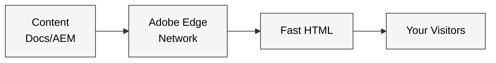
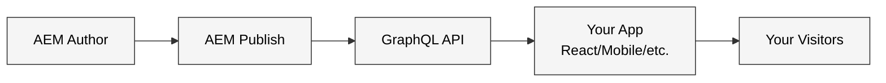
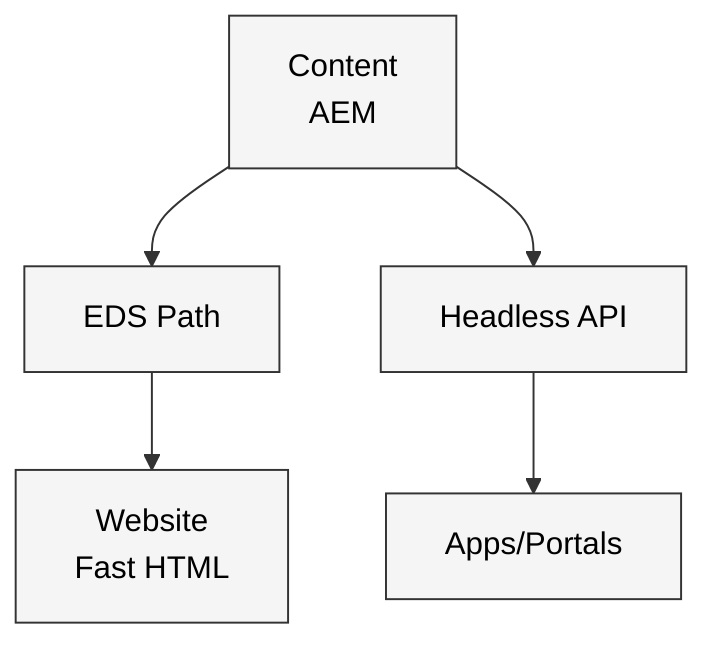

# AEM Edge Delivery Services vs Headless

---

## What Are We Comparing?

**Context:** Adobe Experience Manager (AEM) is an enterprise content management system that helps organizations create, manage, and deliver digital experiences across websites, mobile apps, and other channels. This guide compares three ways to use AEM to deliver those experiences.

### Three Ways to Deliver Digital Experiences with AEM

**🌐 Edge Delivery Services (EDS)**
Think of this as a "website in a box" - delivers complete web pages (HTML) directly from Adobe's global edge network*. Content can be authored in familiar tools like Document Authoring from Adobe, Google Docs, Microsoft Word, or AEM Universal Editor . Optimized for speed and simplicity.

*Edge CDN Network: A global network of servers that delivers your website from locations close to your visitors, reducing load times from seconds to milliseconds.

**📡 Headless (Traditional AEM)**
Your content lives in AEM, but you build the "head" (website or app) yourself. AEM delivers structured content as data (JSON/GraphQL) that your developers consume to build websites, mobile apps, or other digital experiences.

**🔄 Hybrid (EDS + Headless)**
Use both! EDS powers your main website for speed and SEO, while Headless APIs feed your mobile apps, portals, or other channels. One content source, multiple delivery paths.

---

## How They Work (Simplified Architecture)

### Edge Delivery Services

**Key Point:** Content + code → instant website. No traditional servers to manage.

---

### Headless

**Key Point:** You build and control the front-end; AEM is the content API.

---

### Hybrid

**Key Point:** One content source, optimized delivery for each channel.

---

## Pros & Cons at a Glance

| Aspect | EDS ✅/❌ | Headless ✅/❌ | Hybrid ✅/❌ |
|--------|----------|---------------|-------------|
| **Time to Market** | ✅ Fast - no builds, instant publish | ❌ Slower - requires app development | ⚡ EDS fast for web, Headless for apps |
| **Performance** | ✅ Optimized for 100 Lighthouse | ⚠️ Depends on your app | ✅ Best of both worlds |
| **SEO** | ✅ Built-in semantic HTML | ❌ Requires custom implementation on app | ✅ EDS handles SEO pages |
| **Authoring** | ✅ Familiar tools (Docs/AEM) | ✅ Powerful AEM authoring | ✅ Authors use what fits |
| **Authoring Modularity** | ✅ Free-flow content | ⚠️ Fixed schema required | ✅ Free-flow for sites, strict for APIs |
| **Developer Skills** | ✅ HTML/CSS/JS only | ⚠️ Requires AEM framework expertise | ⚠️ Need both skillsets |
| **Code Reuse** | ✅ One repo, many sites (Repoless) | ⚠️ App-dependent | ⚠️ EDS reusable, apps separate |

**Legend:** ✅ Strong advantage | ⚡ Mixed/Contextual | ⚠️ Requires planning | ❌ Limitation/Challenge

---

## Decision Matrix

**Rate each option against your priorities (⭐⭐⭐ = Best fit)**

| Criteria | EDS Only | Headless Only | Hybrid |
|----------|----------|---------------|--------|
| **Time to Market** | ⭐⭐⭐ Instant publish, no builds | ⭐ Requires app development | ⭐⭐ Fast for web, normal for apps |
| **Authoring Flexibility** | ⭐⭐⭐ Move content blocks easily | ⭐⭐ Structured fragments | ⭐⭐⭐ Both models available |
| **Technical Skills Required** | ⭐⭐⭐ Basic web dev (HTML/CSS/JS) | ⭐ React/frameworks + API knowledge | ⭐⭐ Need both skillsets |
| **Use Case: Website** | ⭐⭐⭐ Perfect fit | ⭐ Possible, but more work | ⭐⭐⭐ EDS handles website |
| **Use Case: Mobile App** | ⭐ Limited - indexes only, no querying | ⭐⭐⭐ Native API consumption | ⭐⭐⭐ Headless handles this |
| **Performance** | ⭐⭐⭐ 100 Lighthouse by default | ⭐⭐ Depends on Consumer Apps | ⭐⭐⭐ EDS pages are fast |
| **SEO Importance** | ⭐⭐⭐ Semantic HTML out-of-box | ⭐ Requires SSR/prerendering | ⭐⭐⭐ EDS pages optimized |
| **Operations Flexibility** | ⭐⭐⭐ Config-based, API-driven | ⭐⭐ Code-based changes | ⭐⭐ EDS flexible, Headless less so |
| **Code Reusability** | ⭐⭐⭐ One repo → many sites | ⭐⭐ Depends on consumer app architecture | ⭐⭐ EDS repo highly reusable |
| **Total Cost of Ownership** | ⭐⭐⭐ Lower infrastructure costs | ⭐⭐ Higher infra + dev costs | ⭐⭐ Combined costs, but optimized |

**Scoring Guide:**
- **⭐⭐⭐** Strong fit - minimal trade-offs
- **⭐⭐** Moderate fit - some extra effort required
- **⭐** Possible but not ideal - significant limitations

---
